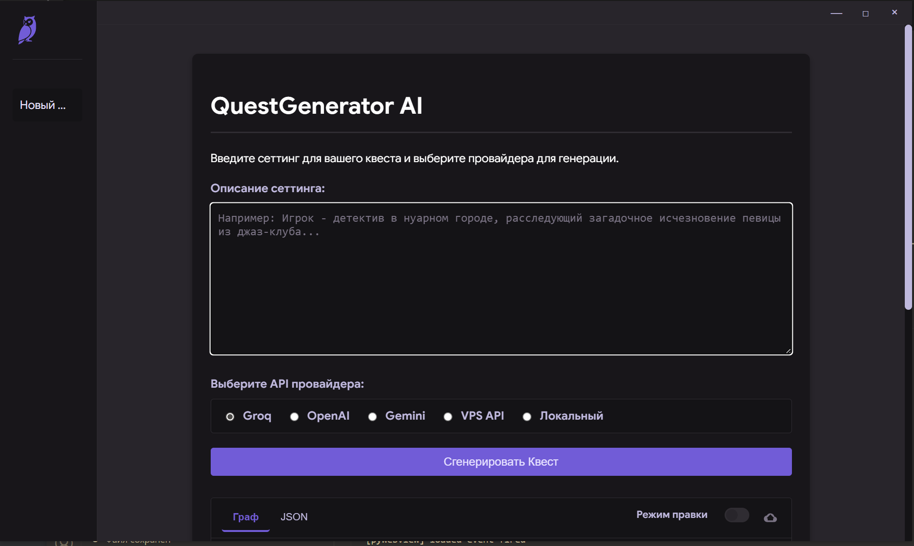

#  Plotix: AI Quest Generator 


**Plotix** — это мощное десктопное приложение для геймдизайнеров, сценаристов и энтузиастов, позволяющее генерировать нелинейные квесты и сюжеты с помощью искусственного интеллекта. Просто опишите сеттинг, и приложение создаст готовую структуру квеста в формате JSON, которую можно сразу использовать в вашем проекте.

Проект разработан в рамках трека «Генерация квестов и сюжетов».

<!--  -->

## 🚀 Ключевые возможности

*   **Мультиплатформенное десктопное приложение:** Работает на Windows, macOS и Linux благодаря PyWebView.
*   **Поддержка нескольких AI-провайдеров:**
    *   ⚡️ **Groq:** Сверхбыстрая генерация.
    *   🧠 **OpenAI:** Доступ к моделям семейства GPT.
    *   🔧 **Google Gemini:** Использование моделей от Google.
    *   💻 **Локальные LLM:** Полная поддержка моделей в формате GGUF для работы оффлайн и без API-ключей (с автоматической установкой `llama-cpp-python`).
*   **Продвинутый интерфейс:**
    *   Управление чатами и историями генераций.
    *   Встроенный менеджер API-ключей с валидацией.
    *   Светлая и темная темы оформления.
    *   Сохранение сгенерированных квестов в `.json` файл через нативный диалог.
*   **Менеджер локальных моделей:**
    *   Скачивание рекомендуемых GGUF-моделей прямо из интерфейса (с Hugging Face).
    *   Отслеживание прогресса скачивания в реальном времени.
    *   Добавление собственных моделей в проект.
    *   Удаление моделей для управления дисковым пространством.
*   **Высокое качество кода:** Проект следует строгим инженерным практикам, включая 100% типизацию, модульную архитектуру и 7-этапную проверку качества кода.

## ✅ Соответствие требованиям задачи

Проект полностью выполняет и превосходит поставленные в задаче требования.

*   **Входные данные:** Приложение принимает текстовое описание сюжета (жанр, герой, цель и т.д.) в главном текстовом поле.
    *   **Примеры:** Для демонстрации в репозиторий добавлена папка `examples/` с тремя примерами входных данных в формате `.txt`.
*   **Выходные данные:** Результат генерируется в виде JSON и может быть сохранен в файл (по умолчанию `quest.json` или любое другое имя, указанное пользователем).
*   **Структура квеста:** Генерация настроена для создания от 5 до 10 сцен с ветвлением и глубиной, как того требуют условия. Выходной JSON имеет строго заданную структуру:

    ```json
    {
      "start_scene": "id_стартовой_сцены",
      "scenes": [
        {
          "scene_id": "уникальный_id_сцены",
          "text": "Описание ситуации...",
          "choices": [
            {
              "text": "Вариант выбора 1",
              "next_scene": "id_следующей_сцены_1"
            },
            {
              "text": "Вариант выбора 2",
              "next_scene": "id_следующей_сцены_2"
            }
          ]
        }
      ]
    }
    ```

## 🛠️ Технологии

*   **Бэкенд:** Python, Flask
*   **Десктопное приложение:** PyWebView
*   **Фронтенд:** HTML5, CSS3, JavaScript (без фреймворков)
*   **AI-интеграции:** `groq`, `openai`, `google-generativeai`, `llama-cpp-python`
*   **Качество кода:** `pytest`, `pytest-cov`, `black`, `flake8`, `pyright`, `bandit`, `pip-audit`

## ⚙️ Установка и запуск

### Требования
*   **Python 3.10+**
*   Для поддержки GPU (опционально, для локальных моделей): **[NVIDIA CUDA Toolkit](https://developer.nvidia.com/cuda-toolkit-archive)** и **[Visual Studio Build Tools](https://visualstudio.microsoft.com/visual-cpp-build-tools/)** (с компонентом "C++ desktop development") на Windows.

### Простой способ (рекомендуемый)

Для максимального удобства используйте универсальный скрипт `start.py`. Он все сделает за вас.

1.  Клонируйте репозиторий:
    ```bash
    git clone https://github.com/sasha2004-art/plotix.git
    cd plotix
    ```
2.  Запустите стартовый скрипт:
    ```bash
    python start.py
    ```
    Скрипт задаст вам вопрос, хотите ли вы установить поддержку локальных моделей. После этого он автоматически:
    *   Создаст виртуальное окружение `.venv`.
    *   Установит все необходимые зависимости.
    *   Попытается установить `llama-cpp-python` с поддержкой GPU (если выбрана соответствующая опция) или переключится на CPU-версию в случае неудачи.
    *   Запустит десктопное приложение.

### Последующие запуски

После первой установки вы можете запускать приложение напрямую:
```bash
python run_desktop.py
```

## 📖 Как использовать

1.  **Запустите приложение** одним из способов, описанных выше.
2.  **Введите сеттинг:** В главном окне введите описание вашего квеста. Чем детальнее описание, тем лучше результат.
3.  **Выберите провайдера:**
    *   Если у вас есть API-ключи, выберите `Groq`, `OpenAI` или `Gemini`. Не забудьте добавить сами ключи на странице настроек (кнопка с шестеренкой).
    *   Если вы хотите работать оффлайн, выберите `Локальный`.
4.  **Выберите модель:** Из выпадающего списка выберите модель, которую хотите использовать. Для локального режима сначала нужно скачать или добавить модели на странице настроек.
5.  **Нажмите "Сгенерировать Квест"** и дождитесь результата.
6.  **Сохраните результат:** Нажмите на иконку скачивания над полем с результатом, чтобы сохранить квест в `.json` файл.

## 🔬 Проверка качества кода

Для проверки соответствия кода всем стандартам качества, запустите универсальный скрипт верификации:
```bash
python scripts/verify.py
```
Этот скрипт выполнит форматирование, линтинг, проверку типов, тесты и анализ безопасности.

## 📂 Структура проекта

```
.
├── app/                  # Основной код приложения Flask
│   ├── services/         # Бизнес-логика (генерация квестов)
│   ├── static/           # CSS, JS, изображения
│   └── templates/        # HTML-шаблоны
├── docs/                 # Дополнительная документация
├── examples/             # Примеры входных .txt файлов
├── scripts/              # Вспомогательные скрипты (verify.py)
├── tests/                # Модульные и интеграционные тесты
├── .env                  # Конфигурация (создается автоматически)
├── AGENTS.md             # Манифест и правила разработки
├── run_desktop.py        # Точка входа для десктопного приложения
├── start.py              # Скрипт для первоначальной установки
└── requirements.txt      # Зависимости Python
```

## 📄 Лицензия

Проект распространяется по лицензии MIT. См. файл `LICENSE` для получения дополнительной информации.

## 👤 Автор

**sasha2004-art**